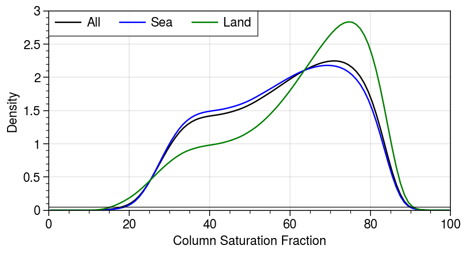
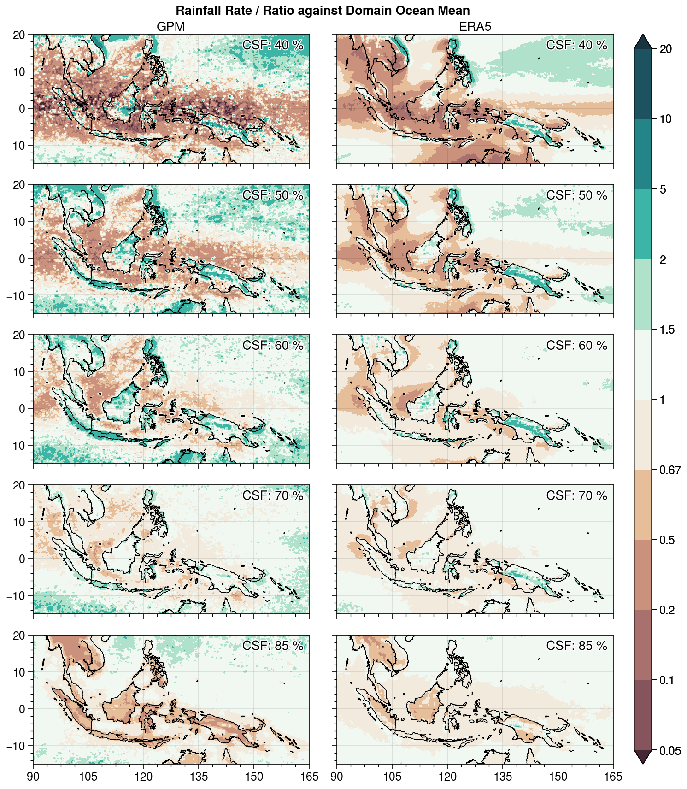
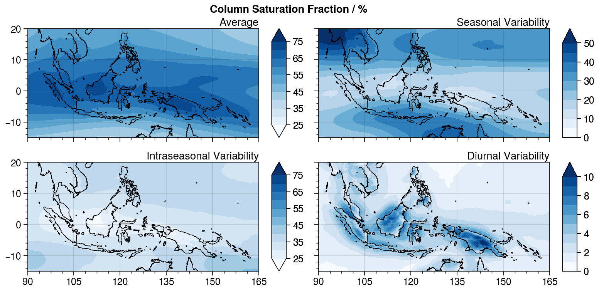

# **<div align="center">MaritimeContPWV: A comparison of Satellite and Reanalysis Precipitable Water products over the Maritime Continent</div>**

This repository contains the analysis scripts and output for the **MaritimeContPWV** project, written in Julia.  We aim to investigate:
   (1) If ERA5 total column water data can be used as a good approximation to satellite and GNSS observations of precipitable water over the Maritime Continent
   (2) What this implies for the relationship between water vapour, column humidity and rainfall rate over the Maritime Continent.
   (3) A baseline check to see if ERA5 precipitation rates are the same as those observed for a given column water/saturation-fraction.

**Created/Mantained By:** Nathanael Wong (nathanaelwong@fas.harvard.edu)\
**Other Contributors:** Lujia Feng (lfeng@ntu.edu.sg)

> In this project I compare the MIMIC-TPW2m satellite and ERA5 reanalysis precipitable water products using GNSS-derived precipitable water as the ground truth. Despite the fact that ERA5 is the product of reanalysis model output, it is closer to GNSS-derived precipitable water values than MIMIC-TPW2m. We postulate that this due to the fact that MIMIC-TPW2m algorithms do not work well over land as compared to the ocean, and therefore reanalysis datasets are still valuable in helping us characterize the climatology of precipitable water vapour over the Maritime Continent. Future studies using precipitable water data should keep this in mind.

## Progress

* [x] Data Downloads
   * [x] Downloaded ERA5 and ERA-Interim Raw Data from CDS
   * [x] Downloaded GPM and TRMM Raw Data from PMM website
   * [x] Retrieved GNSS Raw Data from EOS

* [x] Compare between different Precipitable Water datasets
   - [x] Compare ERA5 and ERA-Interim TCWV with TCW
   - [x] Over land, compare GNSS PWV with ERA5 and ERA-Interim TCWV
   - [x] Over ocean, compare ERA5 and ERA-Interim TCWV with MIMIC-TPW2m

* [ ] Produce TPW-Precipitation curve over land, ocean and coastline
   - [x] General overview curve
   - [ ] Compare curve in different times of year / season
   - [ ] Compare against MJO-Phase/Amplitude data

## 0. Motivation

To improve representation of the Maritime Continent in our models, we first need to understand the climate processes that occur in the Maritime Continent and how the interaction between land and sea modulates these processes.  Here, we focus on building an understanding of the Maritime Continent precipitation and precipitable water climatology based on some of the latest satellite datasets with near-global coverage, specifically the Global Precipitation Mission IMERG precipitation data, the Morphed Integrated Microwave Imagery at CIMSS (MIMIC)-TPW2m precipitable water data, and the new-generation ERA5 reanalysis dataset that also incorporates satellite data.

As a way to validate the MIMIC-TPW2m and ERA5 datasets, I compared both datasets with GNSS-derived values of precipitable water. We are able to do this because GNSS data retrieval, unlike microwave satellite data, is independent from the reflectivity of the surface.

## 1. Validating ERA5 total column water data

### A. Datasets Used

For this part, we used the following datasets:
* **[ERA5](https://rmets.onlinelibrary.wiley.com/doi/full/10.1002/qj.3803)** hourly reanalysis data for total column water at 0.25º spatial resolution
* **[ERA-Interim](https://rmets.onlinelibrary.wiley.com/doi/full/10.1002/qj.3803)** 6-hourly reanalysis data for total column water at 0.75º spatial resolution
* **[MIMIC-TPW2](http://tropic.ssec.wisc.edu/real-time/mtpw2)** data which consists of hourly satellite observational data at 0.25º spatial resolution
* **GNSS** 5/10-min averaged zenith wet delay datasets derived from the SuGAr station in Sumatra (see figure below for reference, red dots are GPS stations)
   * **Π** datasets calculated from the **[PiPWV](https://github.com/natgeo-wong/PiPWV)** project from hourly ERA5 and 6-hourly ERA-Interim data at 1º spatial resolution


The MIMIC-TPW2 and GNSS datasets serve as contrasting but complementary observational datasets used to validate the ERA5 and ERA-Interim reanalysis datasets, which assimilate observations but at their roots are still outputs from model-runs.  MIMIC-TPW2 observations cover both land and ocean, however it has been noted on their website that over land the average error is likely larger than over ocean.  GNSS however, can return accurate point-measurements (given an accurate value of Π, see [here]() for more information) over land and thus complements MIMIC-TPW2's observations over the ocean.

We defined land and ocean points to be where the ERA5 land-sea mask is >0.5 and <=0.5 respectively.

### B. Converting GNSS Zenith Wet Delay (ZWD) to Precipitable Water

A more in-depth explanation of how we can convert GNSS ZWD to Precipitable Water can be found in the **[PiPWV](https://github.com/natgeo-wong/PiPWV)** repository.  Basically, ZWD can be converted to PWV via the "constant" Π, as follows:


In the **PiPWV** project, we have already calculated the values of Π at 1º spatial resolution, hourly for ERA5 data and 6-hourly for ERA-Interim. *(Note: In the near future, I intend to update my results for ERA5 after recalculating Π at native 0.25º resolution as opposed to use 1º interpolated resolution.)*

Because GNSS datasets were provided every 5/10 minutes, I averaged the data into hourly/6-hourly means in order to do a direct comparison against ERA5 and ERA-Interim reanalysis datasets respectively.

### C. Comparison of ERA5/Interim reanalysis against GNSS and MIMIC-TPW2 observations

#### ECMWF reanalysis vs GNSS observations


We see that both ECMWF reanalysis datasets perform reasonably well over land compared to GNSS datasets, where we see that the precipitable water values between reanalysis and observational datasets generally have the highest density close to the `y=x` line.  We see that the peak for ERA5 however, is higher and sharper than for ERA-Interim, which is indicative of the fact that the error between reanalysis and observations is lower in ERA5 compared to ERA-Interim.

#### ECMWF reanalysis vs MIMIC-TPW2m observations


A comparison with MIMIC-TPW2m, however, shows that although indeed the relationship is close to the `y=x` line, there is a significant degree of scatter about this line compared to using GNSS data.  A comparison of the land and sea points shows that indeed, most of this variability comes from land-observation points.  We know that this scatter comes mostly from MIMIC-TPW2m observations due to the fact that a comparison between MIMIC-TPW2m and GNSS datasets yields similar results.

## 2. Comparison of Rainfall Rates to Column Water over the Maritime Continent

### A. Datasets Used

For this part, we used the following datasets:
* **ERA5** hourly reanalysis data for **total column water** and **precipitation** at 0.25º spatial resolution
* **GPM** 30-min **precipitation rates** at 0.1º spatial resolution

Similar to in Section (1), we defined land and ocean points to be where the ERA5 land-sea mask is >0.5 and <=0.5 respectively.

### B. Comparison between Rainfall Rates and Column Water

We bin the ERA5 column water from 10 to 90 mm in steps of 0.5 mm.  For each bin, we calculate the average precipitation rate, to get a precipitation-column water curve similar to that found in Bretherton et al. (2004).  We do this for both GPM and ERA5 precipitation rates.


However, it has been noted by Bretherton et al. (2004) that such curves vary depending on the average sea surface temperature, which in turn influences the average air temperature and therefore the saturation specific humidity.  When they rebinned precipitation rates against column saturation fraction, they found that the different curves in different ocean basins all collapsed very well into a single curve.  Therefore, in a similar manner we investigated the relationship between precipitation rate and column saturation fraction, to see if similar trends that were observed in our comparison between rainfall rate and total column water are applicable here.

This is especially notable, because we also wish to differentiate between the relationship between precipitable water and rainfall rate over land and sea, in order to investigate the different mechanisms at play over vastly different surfaces.  As can be seen by the distribution of precipitable water, the atmospheric column over land tends to be drier than the ocean where absolute values of precipitable water are concerned.  However, it is unknown if this is due to differences in the temperature over land or sea.


### B. Comparison between Rainfall Rates and Column Saturation Fraction

We first investigate the distribution of column saturation fraction in the Maritime Continent over all spatial and temporal points.  We see that despite it being noted above that in terms of absolute precipitable water, land points were drier than the ocean, in terms of column saturation, the atmosphere over land is more saturated than over the ocean.  This implies that the temperature of the atmospheric column is on average lower than that over the ocean, and therefore nears saturation despite having lower values of precipitable water.



For Column Saturation Fraction (CSF) values which, in the plot above, have a probability density of above 0.05 (i.e. 15-90%), we find the mean, as well as the 25th- and 75th-percentiles, of rainfall rate for Column Saturation Fraction, binned in 1% increments.


*(Note: Solid lines represent mean, shaded parts represent 5th and 95th percentiles.)*

We see that there is a noticeable difference in the relationship between precipitation rate and column-saturation fraction over land and sea.  This difference is seen when GPM IMERG precipitation is used, but is much less noticeable (except at lower CSF) in ERA5.  From GPM-IMERG, it can be seen that the relationship between CSF and rainfall rate is weaker on land compared to over the ocean, such that at high CSF, the rainfall rate is lower.  For mid-saturation levels of CSF (50-60%), we see that rainfall is slightly higher over land than on ocean.

We also investigate the spatial distribution of average rainfall rate for four different values of CSF: 25%, 50%, 75% and 90%, as a ratio of the domain-averaged rainfall over all ocean grid-points.



It is immediately apparent that at 50-60% CSF, rainfall over the islands of the Maritime Continent is noticeably enhanced compared to the surrounding ocean.  However, at a CSF of 90%, rainfall over the islands is noticeable lower than the surrounding seas.  Lastly, we also see that rainfall over the ocean near the equator is noticeably lower than rainfall rates as one moves polewards towards the subtropics.  It remains to be seen if this is due to the presence of islands, as opposed to this being a latitude effect.

## 3. Mean Climatology of Column Saturation Fraction in the Maritime Continent

The mean climatology of column saturation fraction is largely as expected, with CSF being highest over land in the Maritime Continent, and near the equator, with gradual decrease as one moves polewards.  However, the same cannot be said for intraseasonal and seasonal variability.  Indeed, although it is expected that seasonal variability would be lower closer to the equator, we see that intraseasonal variability also decreases near the equator, which is interesting because of phenomenon like the Madden-Julian Oscillation that alternatively crosses over the Maritime Continent with wet and dry phases.



The most distinct feature, however, is the diurnal cycle of CSF, which is greatly confined to over land, and especially over the Maritime Continent in the deep tropics.  It remains to be seen if this high variability is present over all land areas in the tropics, or if this region is specific to the Maritime Continent.

## Installation

To (locally) reproduce this project, do the following:

0. Download this code base. Notice that raw data are typically not included in the
   git-history and may need to be downloaded independently.
1. Open a Julia console and do:
   ```
   julia> ] activate .
    Activating environment at `~/Projects/MaritimeContPWV/Project.toml`

   (MaritimeContPWV) pkg> instantiate
   (MaritimeContPWV) pkg> add GeoRegions#master
   ```

This will install all necessary packages for you to be able to run the scripts and
everything should work out of the box.

*(Note: You need to install the #master versions of GeoRegions.jl as of now.)*

## **Other Acknowledgements**
> Project Repository Template generated using [DrWatson.jl](https://github.com/JuliaDynamics/DrWatson.jl) created by George Datseris.
> Work from this project was funded by the [Earth Observatory of Singapore](https://earthobservatory.sg/).
